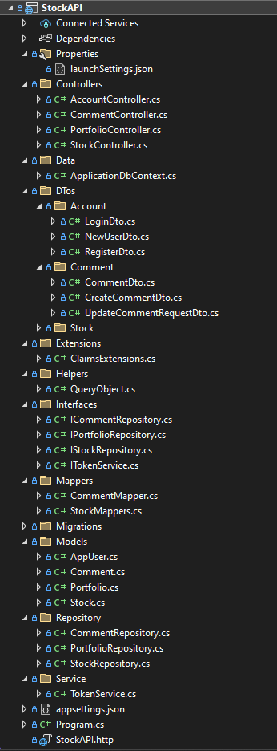

# StockAPI - .NET 8 Stock Management API

StockAPI is a stock management RESTful API built with .NET 8, using **Microsoft SQL Server 2022**, **Entity Framework Core**, and **JWT authentication & authorization**. It allows users to manage stock data, user authentication, and comments while integrating portfolio management.

## Features

- **Stock CRUD Operations**
- **User Authentication & Authorization** (JWT & .NET Identity)
- **Commenting System** (Create, Update, Delete Comments)
- **Portfolio Management**
- **MS SQL Server 2022 as Database**
- **Swagger UI Integration for API Testing**
- **Layered Architecture with Repository Pattern**
- **Security with JWT & Role-Based Authentication**

## Tech Stack

- **Backend:** .NET 8, ASP.NET Core Web API
- **Database:** MS SQL Server 2022, Entity Framework Core
- **Authentication:** JWT, .NET Identity
- **Security:** Authentication & Authorization, Role-based access control
- **API Documentation:** Swagger (Swashbuckle)

## Project Structure



## Installation & Setup

### 1. Clone the Repository

```sh
git clone https://github.com/nishant-nez/StockAPI.git
cd StockAPI
```

### 2. Configure Database

- Update `appsettings.json` with your **SQL Server** connection string:

```json
"ConnectionStrings": {
  "DefaultConnection": "Server=YOUR_SERVER;Database=StockAPI;Trusted_Connection=True;MultipleActiveResultSets=True"
}
```

### 3. Apply Migrations

Run the following commands to create and update the database:

```sh
dotnet ef database update
```

### 4. Run the Application

```sh
dotnet run
```

The API will be available at `https://localhost:5001/`.

## Authentication & Security

- **JWT Authentication:** Generate a token via `/api/account/login` and include it in requests:
  ```sh
  Authorization: Bearer YOUR_TOKEN
  ```
- **Role-based Authorization:** Protects routes based on user roles.

## API Endpoints

### Account

- **POST** `/api/account/login`
- **POST** `/api/account/register`

### Comment

- **GET** `/api/comment`
- **GET** `/api/comment/{id}`
- **PUT** `/api/comment/{id}`
- **DELETE** `/api/comment/{id}`
- **POST** `/api/comment/{stockId}`

### Portfolio

- **GET** `/api/portfolio`
- **POST** `/api/portfolio`
- **DELETE** `/api/portfolio`

### Stock

- **GET** `/api/stock`
- **POST** `/api/stock`
- **GET** `/api/stock/{id}`
- **PUT** `/api/stock/{id}`
- **DELETE** `/api/stock/{id}`

## Swagger API Documentation

Swagger is available at:

```
https://localhost:5001/swagger/index.html
```
